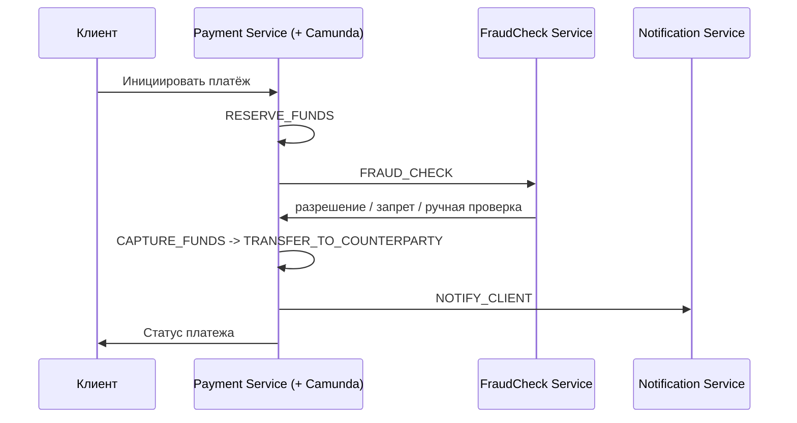
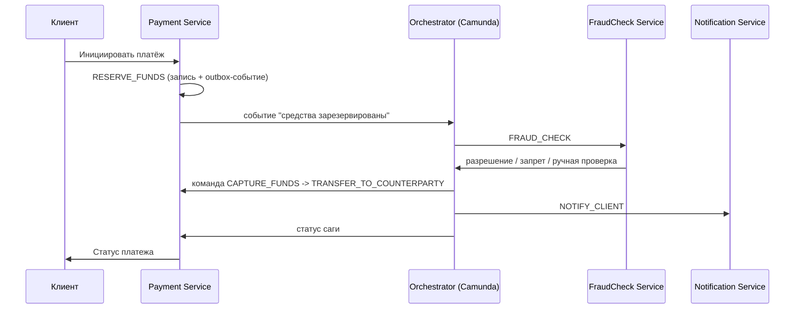

# ADR - Размещение Saga-оркестратора в платежной системе 

## Общая информация 

1. Родительский артефакт - ссылка
2. Автор ADR - Михаил К.
3. Статус - На согласовании
4. Согласующие - Ревьюер ЯП

## Контекст

Вопрос решаемый в ADR - где разместить Saga-оркестратор:
- в отдельном сервисе
- или для его локации использовать один из сервисов, по смыслу подходит Payment Service

Текущая задача требует определиться с размещением оркестратора в платежной системе.

Платежная система состоит из сервисов:
- payment service - основной сервис обработки платежей
- fraud service
- notification service

Бизнес процесс для данной системы - сложный, так как в рамках одной транзакции задействовано несколько сервисов выполняющие действия:
- списания средств
- перевод контрагенту
- отправка уведомлений
- возврат средств
- откат статусов

Возврат средств инициируется на любом этапе(до точки невозврата), например, FraudCheck отклонил транзакцию.

**Критически важно фиксировать текущее состояние процесса И хранить состояния с ожиданием ответа от сервисов проверок.**

Качество Observability - высокое: мониторинг, трассировка реализованы на всех уровнях системы, что обеспечивает прозрачность системы для всех участников.

Стек компании предполагает использование движка BPMN - camunda. Для исполнения бизнес-процесов и реализации Saga-оркестрации с компенсационными транзакциями.

## Рассмотренные варианты

### Вариант №1 "Оркестратор как чать Payment Service"

Camunda-движок подключается как библиотека внутри Payment Service. 
В Payment Service реализована state machine саги и напрямую, 
без дополнительного сетевого перехода, вызывает FraudCheck Service, Notification Service 
и другие второстепенные сервисы не рассматриваемые в данном решении.

### Вариант №2 "Оркестратор как отдельный сервис"

Saga-оркестратор, а именно Camunda разворачивается как самостоятельный сервис со своим хранилищем состояний. 
Payment Service, FraudCheck Service и Notification Service остаются участниками Saga оркестрации, 
которые оркестратор вызывает по шагам. 
И от которых получает события через очередь (необходимо предусмотреть transactional outbox на стороне участников для надёжной доставки и идемпотентность по составному ключу ID-транзакции + имя шага/состояния).

## Сравнение альтернатив

| Вариант решения                                   | Преимущества                                                                                                                                                                                                                                                                                                                                                                                                                                                                        | Недостатки                                                                                                                                                                                                                                    |
|---------------------------------------------------|-------------------------------------------------------------------------------------------------------------------------------------------------------------------------------------------------------------------------------------------------------------------------------------------------------------------------------------------------------------------------------------------------------------------------------------------------------------------------------------|-----------------------------------------------------------------------------------------------------------------------------------------------------------------------------------------------------------------------------------------------|
| Вариант №1 "Оркестратор как чать Payment Service" | Нет дополнительных сетевых переходов Меньше компонентов для деплоя Нет затрат на дополнительные хопы                                                                                                                                                                                                                                                                                                                                                                         | BPM-специфика смешивается с доменным кодом платежей — риск превращения Payment Service в "Сервис-Бога" Развитие BPM требует передеплоя Payment Service, что мешает независимому тестированию и релизам домена платежей                     |
| Вариант №2 "Оркестратор как отдельный сервис"     | BPM специфичный код и формы изолированы от доменной логики платежей, логика Payment Service не будет вытеснена специфичным кодом Camunda UI формы для ручной проверки принадлежат отдельному оркестратору Независимое тестирование, масштабирование и деплой оркестратора и Payment Service как отдельных слоев Camunda хранит состояние саги, включая состояния ожидания ответа от проверок, в собственном хранилище — закрывает требование к фиксации состояния процесса | Дополнительный сетевой переход на каждый шаг саги Появляется риск рассинхронизации состояния между БД Payment Service и БД оркестратора — требует transactional outbox и идемпотентности команд (составной ключ id-транзакции + имя шага)  |
 
## Принятое решение

Принят **Вариант №2 "Оркестратор как отдельный сервис"**.

Обоснование:

1. **Латентность приемлема.** Даже при пессимистичной оценке (около 20 дополнительных сетевых переходов по 20–30 мс) итоговая добавленная задержка укладывается в доли секунды на фоне SLA p90 < 5 секунд. Если не укладываемся в SLA, то причина вовсе не дополнительные хопы, проблемы в инфраструктуре, не оптимизированные запросу к БД или не оптимизированный код, а также возможно броблемы у внешних провайдеров или внутренних сервисах. Увеличенное кол-во хопов можно быстрей обработать путем улучшение сетевой инфрастуктуры - увеличение пропускной способности, то есть увеличение RPS
2. **Разделение слоев.** Наружу выносится не знание о шагах домена (оркестратор всё равно должен знать шаги саги), а инфраструктурная сложность BPM-движка: версионирование процессов, UI, логика. Специфика движка имеет отдельную смысловую нагрузку и не должна перегружать Payment Service, что в конечном итоге может привести к вытеснению основного смысла платежного сервиса.
3. **Специфика BPM движка.** Ручная проверка FraudCheck предполагает форму для оператора - команды Customer Support/Безопасность, а не команда Payment Service. Отдельный оркестратор - естественное место для этого интерфейса.
4. **Владение и эксплуатация.** Даже если оркестратор и Payment Service принадлежат одной команде, разделение на два слоя даёт независимые CI/CD.
5. **Согласованность состояния решаема.** Риск рассинхронизации между БД Payment Service и БД оркестратора закрывается transactional outbox (атомарная запись локального изменения и события в одной транзакции, доставка at-least-once через очередь) и идемпотентностью обработчиков команд на составном ключе `id-транзакции + имя шаг`, что защищает от повторного выполнения команд вроде `RELEASE_FUNDS` или `REFUND` при повторной доставке.

Стоимость лишнего сетевого перехода (доли секунды) принимается как компромисс ради тестируемости, поддерживаемости и чистоты доменного кода Payment Service.